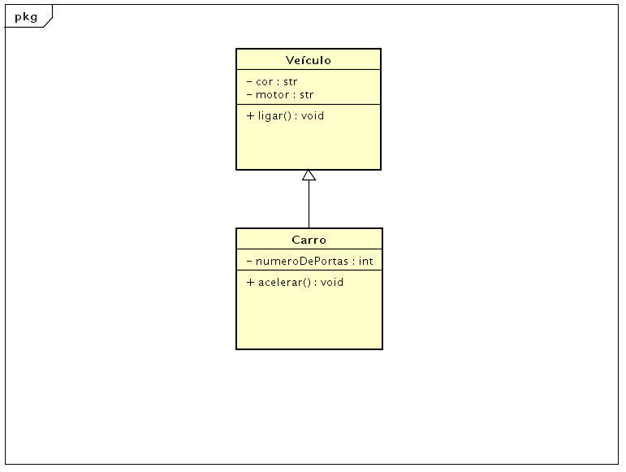

# Apresentação 2o Bimestre Paradigmas de Programação 
### Aluno: Lucas Salvini Bertol  
<br>

# TEMA: HERANÇA E POLIMORFISMO EM JAVA + EXEMPLOS PRÁTICOS
<br>

# **Resumo geral:**

## 1. Herança:

- Você precisa criar diferentes tipos de veículos para sua empresa, como carros, motos e caminhões e todos eles compartilham de **características em comum**, como por exemplo: **ter rodas**.

- Em vez de repetir essa característica em toda classe  (carro, moto e caminhão), você usa a **herança**.

```java
// Superclasse 
class Veiculo {
    String cor;
    String motor;

    void ligar() {
        System.out.println("Veículo ligado!");
    }
}

// Subclasse que herda de Veiculo
class Carro extends Veiculo {
    int numeroDePortas;

    void acelerar() {
        System.out.println("Carro acelerando!");
    }
}

public class Main {
    public static void main(String[] args) {
        Carro meuCarro = new Carro();
        meuCarro.cor = "Vermelho"; // Atributo herdado de Veiculo
        meuCarro.motor = "2.0"; // Atributo herdado de Veiculo
        meuCarro.numeroDePortas = 4; // Atributo próprio de Carro

        meuCarro.ligar(); // Método herdado de Veiculo
        meuCarro.acelerar(); // Método próprio de Carro
    }
}
``` 


<br>

## 2. Polimorfismo:

- Significa **muitas formas**, permite que **um único objeto seja tratado como se fosse de diferentes tipos**.

### 2.1. Polimorfismo @Override (de sobreposição):

```java
class Animal {
    void fazerSom() {
        System.out.println("Som genérico de animal");
    }
}

class Cachorro extends Animal {
    @Override // Indica que estamos sobrescrevendo o método da superclasse
    void fazerSom() {
        System.out.println("Au au!");
    }
}

class Gato extends Animal {
    @Override
    void fazerSom() {
        System.out.println("Miau!");
    }
}

public class Main {
    public static void main(String[] args) {
        Animal animal1 = new Cachorro();
        Animal animal2 = new Gato();

        animal1.fazerSom(); // Imprime "Au au!"
        animal2.fazerSom(); // Imprime "Miau!"
    }
}
```
<br>

### 2.2. Polimorfismo Overloading (de carga):

```java
class Calculadora {
    int somar(int a, int b) {
        return a + b;
    }

    double somar(double a, double b) {
        return a + b;
    }

    int somar(int a, int b, int c) {
        return a + b + c;
    }
}

public class Main {
    public static void main(String[] args) {
        Calculadora calc = new Calculadora();

        // O compilador decide qual método chamar com base nos tipos de argumentos que você passa.

        System.out.println(calc.somar(2, 3));       // Imprime 5
        System.out.println(calc.somar(2.5, 3.5));   // Imprime 6.0
        System.out.println(calc.somar(2, 3, 4));    // Imprime 9
    }
}
```
<br>

## 3. Vantagens em comum:

- **Reutilização de código** e **Extensibilidade:** 

## 4. Conclusão:

- Herança **cria novas classes a partir de uma existente**, enquanto polimorfismo **usa objetos de classes diferentes de forma adaptável**.
