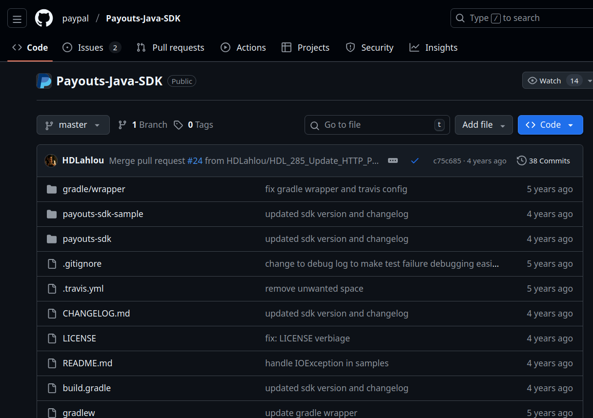
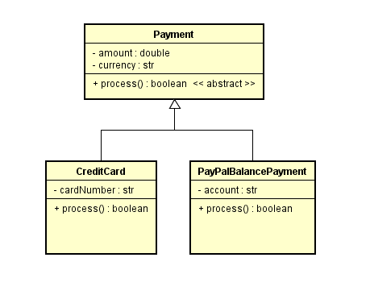
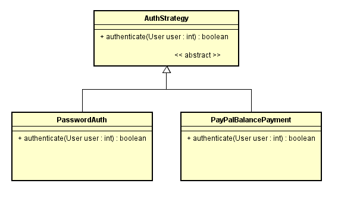
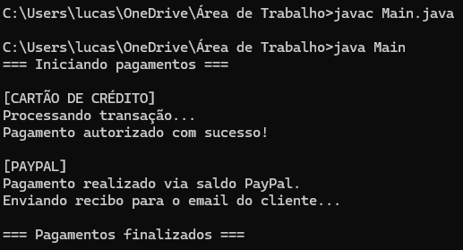

# Apresentação 2o Bimestre Paradigmas de Programação 
### Aluno: Lucas Salvini Bertol  
<br>

# TEMA: HERANÇA E POLIMORFISMO EM JAVA + EXEMPLO PRÁTICO
<br>

---

# **Resumo geral:**

## 1. Herança:

```java
// Superclasse 
class Veiculo {
    String cor;
    String motor;

    void ligar() {
        System.out.println("Veículo ligado!");
    }
}

// Subclasse que herda de Veiculo
class Carro extends Veiculo {
    int numeroDePortas;

    void acelerar() {
        System.out.println("Carro acelerando!");
    }
}

public class Main {
    public static void main(String[] args) {
        Carro meuCarro = new Carro();
        meuCarro.cor = "Vermelho"; // Atributo herdado de Veiculo
        meuCarro.motor = "2.0"; // Atributo herdado de Veiculo
        meuCarro.numeroDePortas = 4; // Atributo próprio de Carro

        meuCarro.ligar(); // Método herdado de Veiculo
        meuCarro.acelerar(); // Método próprio de Carro
    }
}
``` 
---

<br>

## 2. Polimorfismo:

### 2.1. Polimorfismo @Override (de sobreposição):

```java
class Animal {
    void fazerSom() {
        System.out.println("Som genérico de animal");
    }
}

class Cachorro extends Animal {
    @Override // Indica que estamos sobrescrevendo o método da superclasse
    void fazerSom() {
        System.out.println("Au au!");
    }
}

class Gato extends Animal {
    @Override
    void fazerSom() {
        System.out.println("Miau!");
    }
}

public class Main {
    public static void main(String[] args) {
        Animal animal1 = new Cachorro();
        Animal animal2 = new Gato();

        animal1.fazerSom(); // Imprime "Au au!"
        animal2.fazerSom(); // Imprime "Miau!"
    }
}
```
<br>

### 2.2. Polimorfismo Overloading (de carga):

```java
class Calculadora {
    int somar(int a, int b) {
        return a + b;
    }

    double somar(double a, double b) {
        return a + b;
    }

    int somar(int a, int b, int c) {
        return a + b + c;
    }
}

public class Main {
    public static void main(String[] args) {
        Calculadora calc = new Calculadora();

        // O compilador decide qual método chamar com base nos tipos de argumentos que passar.

        System.out.println(calc.somar(2, 3));       // Imprime 5
        System.out.println(calc.somar(2.5, 3.5));   // Imprime 6.0
        System.out.println(calc.somar(2, 3, 4));    // Imprime 9
    }
}
```
---

| Override (Sobreposição) | Overload (Sobrecarga) |
|------------------------|----------------------|
| **Mesma assinatura**, comportamento diferente | **Assinaturas diferentes**, mesmo nome |
| Requer herança | Pode ser na mesma classe |
| `@Override` ou Sem notação | Não usa anotação |
| `fazerSom()` em Cachorro e Gato | `somar(int, int)` vs `somar(double, double)` |

<br>

---

# PAYPAL


- A empresa de pagamentos PayPal usava um backend em Java até antes de 2013

- Migraram pro node.js por ser no minimo 35% mais rápido e diminui o tamanho do código quase pela metade(!)

<br>



## Uso de heranças e polimorfismo:

```java
public abstract class Payment {
    protected double amount;
    protected String currency;
    public abstract boolean process(); 
}

public class CreditCardPayment extends Payment {
    private String cardNumber;
    @Override
    public boolean process() {
        // lógica específica para cartão
        return true;
    }
}

public class PayPalBalancePayment extends Payment {
    private String accountId;
    @Override
    public boolean process() {
        // lógica para saldo interno
        return true;
    }
}
```


<br>
<br>

```java
public abstract class AuthStrategy {
    public abstract boolean authenticate(User user);
}

public class PasswordAuth extends AuthStrategy {
    public boolean authenticate(User user) {
        // verifica senha
    }
}

public class TokenAuth extends AuthStrategy {
    public boolean authenticate(User user) {
        // verifica token JWT
    }
}
```


<br>

---

## Por que abstract?

- PayPal pode receber dezenas de modos de pagamentos diferentes

- Sem classe abstrata não teria um padrão nos métodos

- Padronização do código

---
<br>

# Exemplo criado:

```java
abstract class Payment {
    public abstract void process();
}

class CreditCardPayment extends Payment {
    @Override
    public void process() {
	System.out.println("[CARTÃO DE CRÉDITO]");
        System.out.println("Processando transação...");
        System.out.println("Pagamento autorizado com sucesso!");
    }
}

class PayPalPayment extends Payment {
    @Override
    public void process() {
	System.out.println("[PAYPAL]");
        System.out.println("Pagamento realizado via saldo PayPal.");
        System.out.println("Enviando recibo para o email do cliente...");
    }
}

public class Main {
    public static void main(String[] args) {
        Payment p1 = new CreditCardPayment();
        Payment p2 = new PayPalPayment();

        System.out.println("=== Iniciando pagamentos ===\n");
        p1.process();
        System.out.println();
        p2.process();
        System.out.println("\n=== Pagamentos finalizados ===");
    }
}

```

## Saída:



---

<br>


# Bibliografia

ANDREA, INF. ELC117 - Aula 22. Disponível em: https://liascript.github.io/course/?https://raw.githubusercontent.com/AndreaInfUFSM/elc117-2025b/main/classes/22/README.md#1

ANDREA, INF. ELC117 - Aula 23. Disponível em: https://liascript.github.io/course/?https://raw.githubusercontent.com/AndreaInfUFSM/elc117-2025b/main/classes/23/README.md#1

PAYPAL. Payouts Java SDK. GitHub, 2025. Disponível em: https://github.com/paypal/Payouts-Java-SDK/tree/master

DEVMEDIA. Encapsulamento, polimorfismo e herança em Java. Disponível em: https://www.devmedia.com.br/encapsulamento-polimorfismo-heranca-em-java/12991


